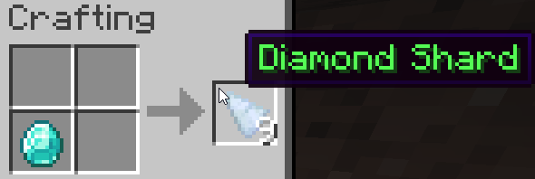
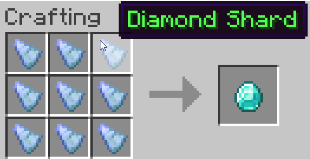

# DiamondNugs
A simple Spigot Minecraft Plugin which allows users to create diamond shards, and allows shards to be recombined to whole diamonds. This allows them to be more usefully used as an unofficial currency on servers, as you can now have prices in a fraction of a diamond.

Currently this mod is using Prismarine shards as a stand-in for these shards. Because of this they will be able to craft most recipes that prismarine shards can make, until additional handling is added to prevent this.

